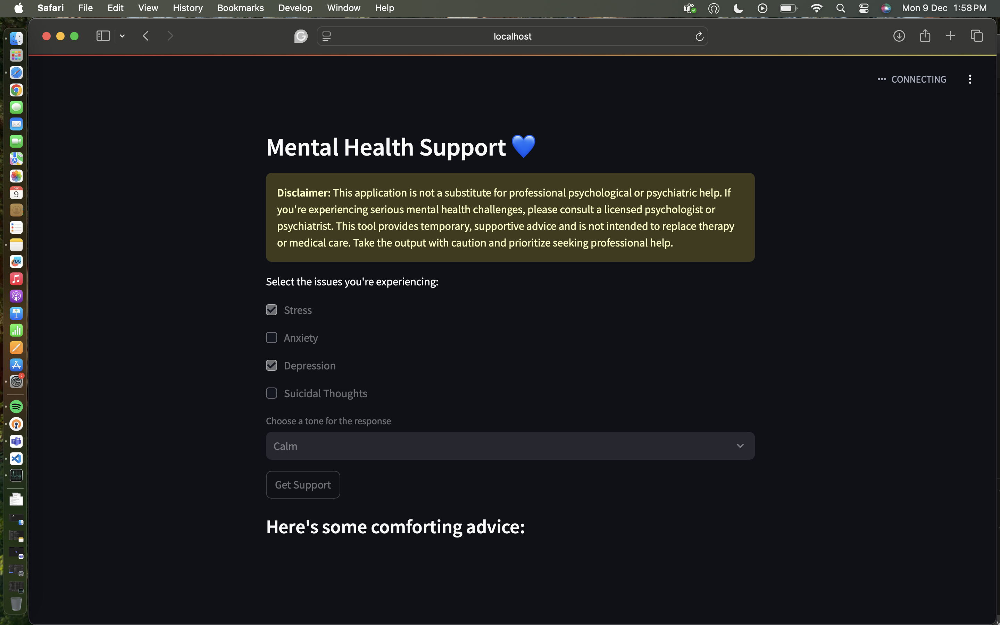

# Mental Health Support Chatbot 💙

## Overview

This project is a **Mental Health Support Chatbot**, built to provide temporary, supportive advice for individuals experiencing challenges like stress, anxiety, depression, and more. The chatbot employs **Streamlit** for a user-friendly web interface and uses the **LLaMA 2 model** for generating responses based on selected concerns and tones.

The primary purpose of this application is to offer **comforting and practical advice** to users, while emphasizing that it is not a substitute for professional help. It showcases how I can set up a basic mental health chatbot using **LLMs (Large Language Models)** on a web-based platform. 

This project is inspired by the tutorial video by **Krish Naik** ([source](https://www.youtube.com/watch?v=cMJWC-csdK4)) and has been customized to enhance its functionality and educational value.

---

## Key Features

### 1. **User-Friendly Interface**
The application uses **Streamlit** to create a simple, visually appealing interface that allows users to:
- Select the mental health challenges they are experiencing (e.g., stress, anxiety, depression, suicidal thoughts).
- Choose the tone of the response (Calm, Empathetic, or Uplifting).
- Receive a comforting message tailored to their inputs.

### 2. **Customizable Tone and Issues**
- The chatbot generates messages that adapt to the user's chosen tone, ensuring empathetic and appropriate responses.
- Users can select multiple challenges, and the chatbot generates advice addressing all selected issues.

### 3. **Disclaimer for Safety**
- A visible **disclaimer** emphasizes that the chatbot is not a replacement for therapy or medical care and encourages users to consult a licensed professional if needed.

### 4. **LLaMA 2 Integration**
The project uses the **LLaMA 2 model (7B-parameter variant)** for generating natural, empathetic responses. 

---

## Limitations

### 1. **Not a Replacement for Therapy**
This chatbot is designed to provide temporary support and encouragement but is **not intended to diagnose or treat mental health conditions**. Its purpose is educational, demonstrating how LLMs can be leveraged in sensitive applications.

### 2. **Hardware Limitations**
The LLaMA 2 model is computationally intensive. Due to my laptop's **limited hardware (insufficient RAM and GPU resources)**, I am unable to run this code locally. However, it has been tested on compatible hardware setups, such as **cloud-based environments** or systems with higher RAM and GPU capabilities.

### 3. **Still Learning**
As I continue my journey into LLMs, this project reflects my **beginner-level understanding** of large language models and chatbot development. With time and experience, I plan to enhance this application further, exploring deployment options like **Hugging Face Spaces**, **AWS**, or **Google Colab** for running the model efficiently.

---

## Technical Details

### Technology Stack
- **Frontend:** Streamlit (for UI)
- **Backend:** LLaMA 2 (7B Chat variant) via the `langchain_community.llms` and `CTransformers` libraries.
- **Model:** [Llama-2-7B-Chat-GGML](https://huggingface.co/TheBloke/Llama-2-7B-Chat-GGML/blob/main/llama-2-7b-chat.ggmlv3.q4_0.bin) (quantized for efficient usage).

### How It Works
1. **User Input:** Users select mental health issues they are facing and their preferred tone for the response.
2. **Prompt Generation:** A dynamically generated prompt combines the user's inputs and is passed to the LLaMA 2 model.
3. **Response:** The model generates a comforting message tailored to the user's concerns and tone.
4. **Output:** The response is displayed on the Streamlit interface for the user.

---

## Future Enhancements

- **Deploy on Cloud Platforms:** Implement on cloud services like AWS or Google Colab for live testing and broader accessibility.
- **Add More Options:** Include additional tones and mental health issues for greater personalization.
- **Resource Optimization:** Explore model quantization or other LLMs with lower hardware requirements.
- **Language Support:** Extend support for multiple languages to reach a global audience.

---

## Setup Instructions

To run this project (if hardware permits), follow these steps:

1. **Install Dependencies:**
   ```bash
   pip install streamlit langchain langchain-community CTransformers
   ```
2. **Download the Model: Download the Llama-2-7B-Chat-GGML model from here and save it in a models directory.
3. **Run the App:
```bash
streamlit run mental_health_chatbot.py
```
4. **Access localhost to view the chatbot

# Mental Health Support Chatbot 💙

## Overview

This project is a **Mental Health Support Chatbot**, built to provide temporary, supportive advice for individuals experiencing challenges like stress, anxiety, depression, and more. The chatbot employs **Streamlit** for a user-friendly web interface and uses the **LLaMA 2 model** for generating responses based on selected concerns and tones.

The primary purpose of this application is to offer **comforting and practical advice** to users, while emphasizing that it is not a substitute for professional help. It showcases how I can set up a basic mental health chatbot using **LLMs (Large Language Models)** on a web-based platform.

---

## Included Image

Below is a sample interface screenshot (`streamlit.png`) showing the application's functionality.



---

## Acknowledgments

- **Krish Naik** for the inspirational tutorial.
- **Hugging Face Community** for making state-of-the-art models accessible.
- **Streamlit** for providing a fantastic platform to build intuitive interfaces.

---

Thank you for reviewing my project! While this is an initial attempt, it demonstrates my ability to build functional applications, integrate advanced AI models, and create meaningful tools that can help people. I am excited to continue growing and improving in the field of **Large Language Models** and **AI**.

